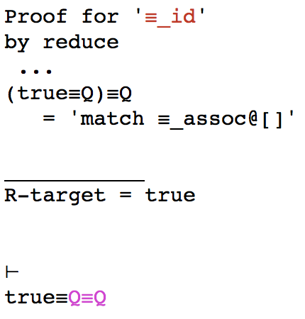
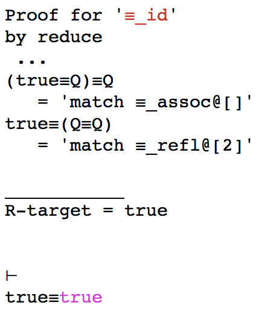
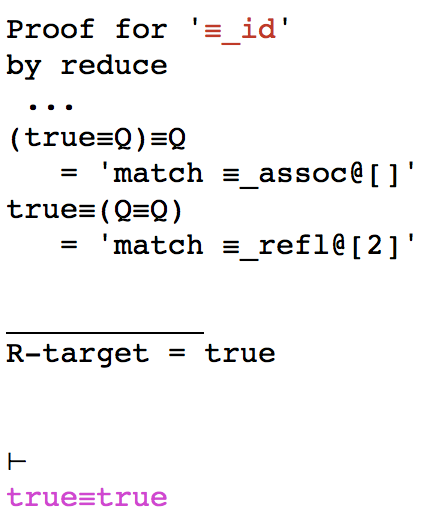

# reasonEq Tutorial

## Prerequisites

`reasonEq` has been installed and started for at least the first time according to instructions
in the top-level `README.md`.

You should have seen a transcript similar to this (precise details depend on your OS - that below was on macOS):

```
:- req
starting REPL...
Running user mode, default initial state.
Creating app. dir.: /Users/yourusername/.reasonEq
Creating workspace : /Users/yourusername/.../MyReasonEq
appFP = /Users/yourusername/.reasonEq
projects:
*MyReasonEq|/Users/yourusername/.../MyReasonEq

Creating /Users/yourusername/.../MyReasonEq
Creating /Users/yourusername/../MyReasonEq/project.req
Project Name: MyReasonEq
Project Path: /Users/yourusername/TEST/MyReasonEq
Loading...
Welcome to the reasonEq 0.6.9.0 REPL
Type '?' for help.

MyReasonEq.> 
```

You are now using the "Top-Level" command line interface.

## Getting Help

Requesting help by typing `help` or `?` results in:

```
quit -- exit
?,help -- this help text
?,help <cmd> -- help for <cmd>
sh -- show parts of the prover state
set -- set parts of the prover state
new -- generate new theory items
N -- new proof
r -- return to live proof
save -- save prover state to file
load -- load prover state from file
svc -- save conjectures
ldc -- load conjectures
Assume -- assume conjecture is law
Demote -- demote law to conjectures
b -- builtin theory handling
classify -- activate classifier
```

More help on a specific command is given by supplying it to help,
so, for example, typing `? sh` results in:

```
sh w -- show workspace info
sh X -- show settings
sh s -- show logic signature
sh t -- show theories
sh L -- show laws
sh L -u -- show variable uniqueness
sh k -- show known names
sh T -- show 'current' theory
sh c -- show current conjectures
sh c -u -- show variable uniqueness
sh p -- show current (live) proof
sh P -- show completed theory proofs
sh P * -- show all completed proofs
sh P <nm> -- show proof transcript for <nm>
```

## Builtin Theories

Currently it is not possible for the user to create new theories,
or add new axioms to existing theories.
Instead, some builtin theories have been defined, but they are not "installed" by default.

The `b` command allows the installation and checking of builtin theories. Entering `? b` results in the following:

```
b e -- list all existing builtin theories
b i -- list all installed theories
b I <name> -- install builtin theory <name>
           -- fails if theory already installed
b R <name> -- reset builtin theory <name>
           -- replaces already installed theory by builtin version
                                        (a.k.a. 'factory setting')
b U <name> -- update builtin theory <name>
           -- adds in new material from builtin version
           -- asks user regarding revisions to existing material
b F <name> -- force-update builtin theory <name>
           -- adds in new and revised material from builtin version
           -- does not ask user to confirm revisions
```

Issuing the command `b e` should result in:

```
Equiv ; Not ; Or ; And ; AndOrInvert ; Implies ; Equality ; ForAll ; Exists ; UClose ; UTPBase
Remember to update Dev.devKnownBuiltins with new builtins.
```

For this tutorial we need theory `Equiv` to be installed using `b I`,
and checked using `b i`:

```
MyReasonEq.> b I Equiv
MyReasonEq.Equiv*> b i
Equiv
MyReasonEq.Equiv*> 
```

The `Equiv` theory is installed and is now the current working theory. The prompt now includes the current theory name. The asterisk on the prompt indicates that the prover state has been modified, but not yet saved.
Save it, just to be safe:

```
MyReasonEq.Equiv*> save
REQ-STATE written to '/Users/yourusername/.../MyReasonEq'.
MyReasonEq.Equiv>  
```

Now, ask to see all the known laws, using `sh L` :

```

---
Theory 'Equiv'
Knowns:
≡ : (𝔹 ⟶ (𝔹 ⟶ 𝔹))
Laws:
   1. ⊤  “true”      true  ⊤
   2. ⊤  “≡_refl”    P  ≡  P  ⊤
   3. ⊤  “≡_assoc”   ((P≡Q)≡R)  ≡  (P≡(Q≡R))  ⊤
   4. ⊤  “≡_symm”    P≡Q≡Q≡P  ⊤
   5. ⊤  “id_subst”  P[x$/x$]  ≡  P  ⊤
Conjectures:
   1. ❓  “≡_id”        (true≡Q)  ≡  Q  ⊤
   2. ❓  “true_subst”  true[e$/x$]  ≡  true  ⊤
   3. ❓  “≡_subst”     (P≡Q)[e$/x$]  ≡  (P[e$/x$]≡Q[e$/x$])  ⊤
AutoLaws:
   i. simps:

  ii. folds:

 iii. unfolds:


MyReasonEq.Equiv> 
```

There are four sections:

**Knowns** :	
	  Identifiers that denote themselves only.
	
**Laws** :
	  All available laws. Axioms are marked on the left with '⊤'
	
**Conjectures** :
	  All available conjectures, marked on the left with '❓'. 
	  These need proofs to become theorems.
	  
The use of '⊤' on the right indicates a trivial (true) side-condition.
	
**AutoLaws**:
	  Lists of laws that can play specific roles in proof automation.

## Finding Conjectures

We can concentrate on conjectures using `sh c` :

```
   1. “≡_id”        (true≡Q)  ≡  Q  ⊤
   2. “true_subst”  true[e$/x$]  ≡  true  ⊤
   3. “≡_subst”     (P≡Q)[e$/x$]  ≡  (P[e$/x$]≡Q[e$/x$])  ⊤
```

There is only one in this case. 

## Proving “≡_id”

Start a new proof by entering `N 1` (new proof for conjecture 1).
You are shown a list of four options:

```
REq ≡ N 1
   1. 'reduce':   ⊢ (true≡Q)≡Q = true
   2. 'redboth':   ⊢ true≡Q = Q
   3. 'redtail':   ⊢ Q = true≡Q
   4. 'redinit':   ⊢ true≡Q = Q
Select sequent by number: 
```
Each option corresponds to a different strategy that is applicable
to the conjecture.
Proof strategies will be described in detail elsewhere,
and for now we will simply select the `reduce` strategy by typing `1`. 
This strategy is simply to try to reduce the whole conjecture down to `true`.
In effect we are going to prove this by reducing the lefthand-side
`(true≡Q)≡Q` to the righthand-side `true`.

Entering `1` causes the screen to clear (on OS X/Unix at least)
and displays something like this:


We see that we are proving conjecture `≡_id` using the `reduce` strategy. 
We are told that our target (righthand-side) is `true`.
We see our lefthand-side displayed, in color,
and finally we see that we have a new command line prompt `proof:`.

You are now in the Prover command line interface.
This has a different set of commands to the top-level one,
but still has the same help mechanism:

```
proof: ?

q -- exit
? -- this help text
? <cmd> -- help for <cmd>
ll -- list laws
d -- down
u -- up
m -- match laws
a -- apply match
fe -- flatten equivalences
ge -- group equivalences
b -- go back (undo)
i -- instantiate
s -- switch
h -- to hypothesis
l -- leave hypothesis
c -- clone hyp
```

### Proof Step 1

We start by invoking the `Matcher` that tries to match the current
goal, here `(true≡Q)≡Q`, against known laws.
This is done by typing `m` to produce:

```
Matches:
1 : “≡_assoc” gives     true≡(Q≡Q)  
2 : “≡_symm” gives     Q≡(true≡Q)  
3 : “≡_symm” gives     Q≡(true≡Q)  
4 : “≡_symm” gives     ((true≡Q)≡Q)≡Q≡Q  
5 : “≡_symm” gives     P≡((true≡Q)≡Q)≡P  
6 : “≡_symm” gives     P≡((true≡Q)≡Q)≡P  
7 : “≡_symm” gives     Q≡Q≡((true≡Q)≡Q)  
8 : “∨_idem” gives     ((true≡Q)≡Q)∨((true≡Q)≡Q)  
9 : “⟹ _def” gives     P⟹ ((true≡Q)≡Q)≡P∨((true≡Q)≡Q)
```
The matcher tries to match the goal against entire laws, in which case it would report a match that "gives true". It also takes laws
of the form `P≡Q` and try to match the goal against just `P` and just `Q`. If it succeeds in matching against `P`, then it "gives Q" back (and vice-versa.)

In our case, we see that it matched, amongst other things,
 against the lefthand-side
of the `≡_assoc` law and is giving back the righthand-side. 
This is what we want so we request that match 1 be applied,
using command `a 1` (or `a1`).

This results in:


We see that the goal has changed,and also that we have the start of a proof transcript showing the the original goal was transformed by a match with the `≡_assoc` law at the top-level.

### Proof Step 2

We now want to focus attention on the `Q≡Q` sub-part of the goal. It is the second argument to thew top-level `≡` operator, so we want to move the focus down to that 2nd argument.
We do this using the command `d 2`:



No we see the sginificance of the purple colour - it signifies that we are focussed in on a part of the overall goal.
We not want to see what this matches against,
so we issue the match command `m` once more:

```
Matches:
1 : “≡_refl” gives     true  
2 : “≡_symm” gives     Q≡Q  
3 : “≡_symm” gives     Q≡Q  
4 : “≡_symm” gives     (Q≡Q)≡Q≡Q  
5 : “≡_symm” gives     P≡(Q≡Q)≡P  
6 : “≡_symm” gives     P≡(Q≡Q)≡P  
7 : “≡_symm” gives     Q≡Q≡(Q≡Q)  
8 : “∨_idem” gives     (Q≡Q)∨(Q≡Q)  
9 : “⟹ _def” gives     P⟹ (Q≡Q)≡P∨(Q≡Q) 
```

Here the first match is against all of the law `≡_refl`,
so we use `a 1` to apply it:



Note that we are still focussed at the same place. Here we matched the law `≡_refl` at the second component of the top-level goal (`@[2]`).

### Proof Step 3

To complete, we want to return to the top-level,
so we issue the up-command `u` :



Now we match (`m`) and see the same matches as the previous step,
so we apply the first (`a1`).

```
proof: a1
Proof Complete
*REq ≡ 

```

The proof is complete, so this reported, and we exit the proof command-line and return top the top-level command line.
If we now ask to see the laws usinf `sh L`, then almost everything
is unchanged, except at the top where we see:

```
*REq ≡ sh L

---
Theory 'PropEquiv'
Known Variables: None
Laws:
   1. ∎  “≡_id”  (true≡Q)≡Q  
Conjectures: None.
---

```

We see the the `PropEquiv` theory has no conjectures anymore,
but a new law (“≡_id”) instead. This law differs from the axioms in `PropAxioms` in that it is marked with `∎` instead of `⊤` to show that it is a theorem with a proof, rather than an axiom.

## Next Steps.

Try installing theory `PropNot` and proving its four conjectures.
