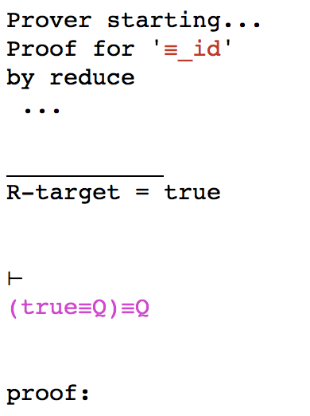

# reasonEq Tutorial

## Prerequisites

`reasonEq` has been installed and started for at least the first time according to instructions
in the top-level  `README.md`.

You should have seen a transcript similar to this:

```
:- req
starting REPL...
Running user mode, default initial state.
Creating app. dir.: /Users/butrfeld/.reasonEq
Creating workspace : /Users/butrfeld/TEST/MyReasonEq
appFP = /Users/butrfeld/.reasonEq
projects:
*MyReasonEq|/Users/butrfeld/TEST/MyReasonEq

Creating /Users/butrfeld/TEST/MyReasonEq
Creating /Users/butrfeld/TEST/MyReasonEq/project.req
Project Name: MyReasonEq
Project Path: /Users/butrfeld/TEST/MyReasonEq
Loading...
Welcome to the reasonEq 0.6.9.0 REPL
Type '?' for help.

REq ≡ 
```

You are now using the "Top-Level" command line interface.

## Getting Help

Requesting help by typing `help` or `?` results in:

```
quit -- exit
?,help -- this help text
?,help <cmd> -- help for <cmd>
sh -- show parts of the prover state
set -- set parts of the prover state
new -- generate new theory items
N -- new proof
r -- return to live proof
save -- save prover state to file
load -- load prover state from file
b -- builtin theory handling
```

More help on a specific command is given by supplying it to help,
so, for example, typing `? sh` results in:

```
sh f -- show current project
sh s -- show logic signature
sh t -- show theories
sh L -- show laws
sh T -- show 'current' theory
sh c -- show current conjectures
sh p -- show current (live) proof
sh P -- show completed proofs
```

## Builtin Theories

Currently it is not possible for the user to create new theories,
or add new axioms to existing theories.
Instead, some builtin theories have been defined, but they are not "installed" by default.

The `b` command allows the installation and checking of builtin theories

```
b e -- list all existing builtin theories
b i -- list all installed theories
b I <name> -- install builtin theory <name>
```

For this tutorial we need theories `PropAxioms` and `PropEquiv` to be installed:

```
REq ≡ b I PropAxioms
*REq ≡ b I PropEquiv
*REq ≡ b i
PropEquiv ; PropAxioms
*REq ≡ 
```

The asterisk on the prompt indicates that the prover state has been modified, but not yet saved.
Save it, just to be safe:

```
*REq ≡ save
REQ-STATE written to '/Users/butrfeld/TEST/MyReasonEq'.
REq ≡ 
```

Now, ask to see all the known laws, using `sh L` :

```
---
Theory 'PropEquiv'
Known Variables: None
Laws: None.
Conjectures:
   1. ❓  “≡_id”  (true≡Q)≡Q  
---
Theory 'PropAxioms'
Known Variables:
false ≜ ¬(true)
true : 𝔹
Laws:
   1. ⊤  “true”         true  
   2. ⊤  “≡_refl”       P≡P  
   3. ⊤  “≡_assoc”      ((P≡Q)≡R)≡(P≡(Q≡R))  
   4. ⊤  “≡_symm”       P≡Q≡Q≡P  
   5. ⊤  “false-def”    false≡¬(true)  
   6. ⊤  “¬_≡_distr”    ¬(P≡Q)≡(¬(P)≡Q)  
   7. ⊤  “∨_symm”       P∨Q≡Q∨P  
   8. ⊤  “∨_assoc”      P∨Q∨R≡P∨Q∨R  
   9. ⊤  “∨_idem”       P∨P≡P  
  10. ⊤  “∨_≡_distr”    P∨(Q≡R)≡P∨Q≡P∨R  
  11. ⊤  “excl-middle”  P∨¬(P)  
  12. ⊤  “golden-rule”  P∧Q≡((P≡Q)≡P∨Q)  
  13. ⊤  “⟹ _def”       P⟹ Q≡P∨Q≡Q  
Conjectures: None.
```

We see that we have two theories installed. At the bottom is the `PropAxioms` theory, which contains thirteen laws, all marked with '⊤' to indicate that they are axioms.
There are also two known predicate variables defined, `true` and `false`.
Above this is the `PropEquiv` theory, which has no laws, but does contain one *conjecture*, a predicate that we hope is true, and which we shall now raise to theoremhood by proving it so. Conjectures are marked with '❓'.

## Finding Conjectures

In order to prove a conjecture we need to ensure 
that its containing theory is "current":

```
REq ≡ sh T
No current theory.
```

If it isn't, as in the above example, then we can make it so:

```
REq ≡ set T PropEquiv
Current Theory now 'PropEquiv'
*REq ≡ 
```

At this point we can ask to see the conjectures available in the
current theory, using `sh c` :

```
   1. “≡_id”  (true≡Q)≡Q  
```

There is only one in this case.

## Proving “≡_id”

Start a new proof by entering `N 1` (new proof for conjecture 1).
You are shown a list of four options:

```
REq ≡ N 1
   1. 'reduce':   ⊢ (true≡Q)≡Q = true
   2. 'redboth':   ⊢ true≡Q = Q
   3. 'redtail':   ⊢ Q = true≡Q
   4. 'redinit':   ⊢ true≡Q = Q
Select sequent by number: 
```
Each option corresponds to a different strategy that is applicable
to the conjecture.
Proof strategies will be described in detail elsewhere,
and for now we will simply select the `reduce` strategy by typing `1`. This strategy is simply to try to reduce the whole conjecture down to `true`.

Entering `1` causes the screen to clear (on OS X/Unix at least)
and displays something like this:

***
<font style="font-family:courier;">
Prover starting...  
Proof for '≡_id'    
by reduce 
 ...  

           
R-target = true  


⊢  
<font color=purple>(true≡Q)≡Q</font>  

proof: 
</font>  
***

